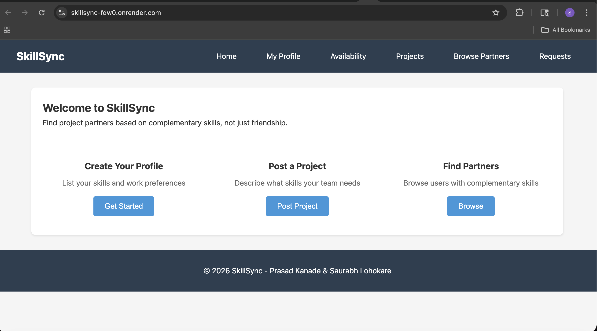

# SkillSync

> Find Project Partners Through Complementary Skills, Not Friendship

[](https://skillsync-fdw0.onrender.com)
[](LICENSE)
[](https://nodejs.org/)
[](https://www.mongodb.com/atlas)

---

## 📋 Table of Contents

- [Overview](#overview)
- [Live Demo](#live-demo)
- [Screenshots](#screenshots)
- [Features](#features)
- [Tech Stack](#tech-stack)
- [Getting Started](#getting-started)
- [API Documentation](#api-documentation)
- [Team](#team)
- [License](#license)

---

## Overview

**SkillSync** is a web application designed to solve the common problem of unbalanced project teams in academic settings. Instead of forming teams based on existing friendships (which often leads to skill gaps), SkillSync matches students based on:

- **Complementary technical skills** - Find partners who have what you lack
- **Schedule compatibility** - Ensure partners can actually meet
- **Work style preferences** - Match morning people with morning people

### The Problem

Students often form project teams with friends, leading to scenarios like:

- Three frontend developers, no one for backend
- Team members with incompatible schedules
- Skill overlap causing role conflicts

### The Solution

SkillSync provides skill gap analysis, availability visualization, and intelligent matching to build balanced, effective project teams.

---

## Live Demo

🔗 **[https://skillsync-fdw0.onrender.com](https://skillsync-fdw0.onrender.com)**

---

## Screenshots

### Home Page



### Profile Creation


### Project Creation


### Browse Partners


### Requests Page


---

## Features

| Feature                    | Description                                                    |
| -------------------------- | -------------------------------------------------------------- |
| **User Profiles**          | Create profiles with name, email, GitHub, and technical skills |
| **Skills Management**      | Add/remove skill tags dynamically                              |
| **Work Style Preferences** | Select morning/night and remote/in-person preferences          |
| **Availability Grid**      | Interactive weekly calendar to mark free time slots            |
| **Project Posts**          | Post project requirements with skills you have and need        |
| **Skill Gap Analysis**     | Visual comparison of your skills vs. project needs             |
| **Browse Partners**        | View and filter users by skill, with match ranking             |
| **Partner Requests**       | Send/accept/decline partnership invitations                    |
| **Full CRUD Operations**   | Create, Read, Update, Delete across all four collections       |

---

## Tech Stack

### Backend

- **Runtime:** Node.js (v18+)
- **Framework:** Express.js 5
- **Database:** MongoDB Atlas (Native Driver)
- **Authentication:** Environment-based secrets

### Frontend

- **Rendering:** Client-side (Vanilla JavaScript)
- **Styling:** CSS Modules
- **Architecture:** Single Page Application (SPA)

### DevOps

- **Hosting:** Render
- **Version Control:** Git/GitHub
- **Code Quality:** ESLint + Prettier

---

## Getting Started

### Prerequisites

- Node.js v18 or higher
- npm v9 or higher
- MongoDB Atlas account (free tier works)

### Installation

1. **Clone the repository**

   ```bash
   git clone https://github.com/Saurabhpl2408/SkillSync.git
   cd SkillSync
   ```

2. **Install dependencies**

   ```bash
   npm install
   ```

3. **Configure environment variables**

   Create a `.env` file in the root directory:

   ```env
   MONGO_URI=mongodb+srv://<username>:<password>@cluster.mongodb.net/skillsync
   PORT=3000
   ```

4. **Seed the database (optional)**

   ```bash
   npm run seed
   ```

5. **Start the development server**

   ```bash
   npm run dev
   ```

6. **Open in browser**
   ```
   http://localhost:3000
   ```

### Available Scripts

| Command        | Description                               |
| -------------- | ----------------------------------------- |
| `npm start`    | Start production server                   |
| `npm run dev`  | Start development server with auto-reload |
| `npm run seed` | Populate database with sample data        |

---

## API Documentation

### Base URL

```
Production: https://skillsync-fdw0.onrender.com/api
Development: http://localhost:3000/api
```

### Users Endpoints

| Method   | Endpoint         | Description     |
| -------- | ---------------- | --------------- |
| `GET`    | `/api/users`     | Get all users   |
| `GET`    | `/api/users/:id` | Get user by ID  |
| `POST`   | `/api/users`     | Create new user |
| `PUT`    | `/api/users/:id` | Update user     |
| `DELETE` | `/api/users/:id` | Delete user     |

### Availability Endpoints

| Method   | Endpoint                          | Description           |
| -------- | --------------------------------- | --------------------- |
| `GET`    | `/api/availability`               | Get all slots         |
| `GET`    | `/api/availability/user/:user_id` | Get user's slots      |
| `POST`   | `/api/availability`               | Create slot           |
| `POST`   | `/api/availability/bulk`          | Create multiple slots |
| `PUT`    | `/api/availability/:id`           | Update slot           |
| `DELETE` | `/api/availability/:id`           | Delete slot           |
| `DELETE` | `/api/availability/user/:user_id` | Delete user's slots   |

### Projects Endpoints

| Method   | Endpoint                     | Description           |
| -------- | ---------------------------- | --------------------- |
| `GET`    | `/api/projects`              | Get all projects      |
| `GET`    | `/api/projects/:id`          | Get project by ID     |
| `GET`    | `/api/projects/user/:id`     | Get user's projects   |
| `GET`    | `/api/projects/skill/:skill` | Get projects by skill |
| `POST`   | `/api/projects`              | Create project        |
| `PUT`    | `/api/projects/:id`          | Update project        |
| `DELETE` | `/api/projects/:id`          | Delete project        |

### Requests Endpoints

| Method   | Endpoint                          | Description           |
| -------- | --------------------------------- | --------------------- |
| `GET`    | `/api/requests`                   | Get all requests      |
| `GET`    | `/api/requests/:id`               | Get request by ID     |
| `GET`    | `/api/requests/sent/:user_id`     | Get sent requests     |
| `GET`    | `/api/requests/received/:user_id` | Get received requests |
| `GET`    | `/api/requests/project/:id`       | Get project requests  |
| `POST`   | `/api/requests`                   | Create request        |
| `PUT`    | `/api/requests/:id/status`        | Update request status |
| `DELETE` | `/api/requests/:id`               | Delete request        |

---

## Team

### Prasad Kanade

- **Responsibilities:** Users & Availability modules
- **Collections:** `users`, `availability_slots`
- **GitHub:** [@prasad0411](https://github.com/prasad0411)

### Saurabh Lohokare

- **Responsibilities:** Projects & Matching modules
- **Collections:** `project_posts`, `partner_requests`
- **GitHub:** [@Saurabhpl2408](https://github.com/Saurabhpl2408)

---

## Course Information

- **Course:** [Web Development - Spring 2026](https://northeastern.instructure.com/courses/245751)
- **Institution:** Northeastern University
- **Instructor:** John Alexis Guerra Gomez

---

## License

This project is licensed under the MIT License - see the [LICENSE](LICENSE) file for details.

---

<p align="center">
  Made by Prasad & Saurabh
</p>
